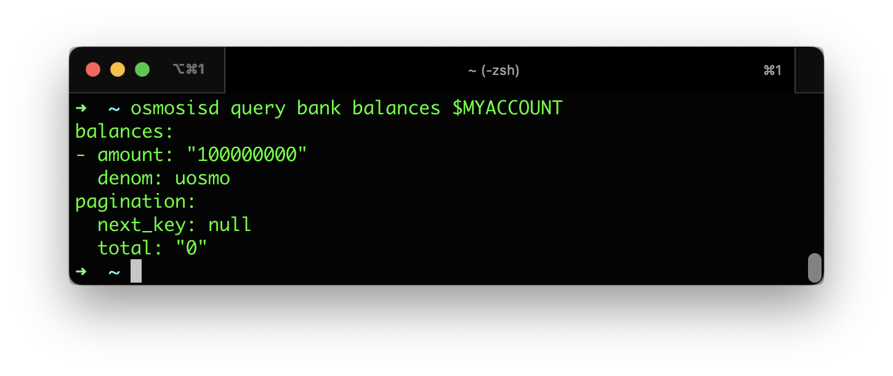

## Using the CLI

Once terpd is [installed](/docs/) and configured with the correct network, you can now send commands with it. In a new terminal window, start by running the following query command:

### Node status
```bash
terpd status
```
<details>
<summary>Output</summary>

<p>
#### This is the output from `terpd status`

```json
{
  "NodeInfo": {
    "protocol_version": {
      "p2p": "8",
      "block": "11",
      "app": "12"
    },
    "id": "4017c243549b8bb4ad2b4cfe5d685aea450dcbcd",
    "listen_addr": "209.34.206.35:26656",
    "network": "tbd",
    "version": "0.34.21",
    "channels": "40202122233038606100",
    "moniker": "artifact-rpc",
    "other": {
      "tx_index": "on",
      "rpc_address": "tcp://0.0.0.0:26657"
    }
  },
  "SyncInfo": {
    "latest_block_hash": "FBA710794C5A9C61523D7CCE78F2F51C7CD7A6C33A154C078E423859D7243E30",
    "latest_app_hash": "EC15E54C7BF66EDC9FEF561969B756CAA58933598FCBF72FE7727DE78F0D8DCF",
    "latest_block_height": "6335644",
    "latest_block_time": "2022-10-07T08:45:15.929540892Z",
    "earliest_block_hash": "38EAF21C7C4A786D73FFAADA32FD3D4B2B683AF2050B41CF5E5924D20AF4EEBC",
    "earliest_app_hash": "808B1D7123C385D52E6A5BC544FD763D156526751DEB401DADB18C717D567DC0",
    "earliest_block_height": "6287475",
    "earliest_block_time": "2022-10-03T22:54:17.633996278Z",
    "catching_up": false
  },
  "ValidatorInfo": {
    "Address": "369E2DCC99CD68400753812BBDF54CD5380FBAC7",
    "PubKey": {
      "type": "tendermint/PubKeyEd25519",
      "value": "mhb68/B38wFLH/5pDgvPKNbKyKdwduIKxJySz0GV/uI="
    },
    "VotingPower": "0"
  }
}
```

</p>
</details>

### Node configuration
```bash
terpd config
```
Output: 
```json
{
	"chain-id": "tbd",
	"keyring-backend": "os",
	"output": "text",
	"node": "http://rpc-terp.zenchainlabs.io:26657",
	"broadcast-mode": "sync",
	"grpc-concurrency": false
}
```
In this example when we install terpd as a client with the [installer](/docs/), it connects to the `http://rpc-terp.zenchainlabs.io:26657`. 

### Change node

```
Terp Network config node https://api-terp.zenchainlabs.io:443/
```

### Connect to the testnet

```bash
terpd config node https://api-terp.zenchainlabs.io:443/
terpd config chain-id 90u-1
```

To add a  new account on your local keyring
```bash
terpd keys add testaccount --keyring-backend test

# Put the generated address in a variable for later use.
MYACCOUNT=$(terpd keys show testaccount -a --keyring-backend test)
```

The command above creates a local key-pair that is not yet registered on the chain. An account is created the first time it receives tokens from another account. 
 You can now send some tokens to this enw account. If you are connected to the testnet, you can get tokens from [https://faucet.terp.network](https://faucet.terp.network)

```bash
# Check that the testaccount account did receive the tokens.
terpd query bank balances $MYACCOUNT
```



 
 


## Using the REST Endpoints

All gRPC services on the Cosmos SDK  and Terp Network are made available for more convenient REST-based queries through gRPC-gateway. The format of the URL path is based on the Protobuf service method's full-qualified name, but may contain small customizations so that final URLs look more idiomatic. For example, the REST endpoint for the `cosmos.bank.v1beta1.Query/AllBalances` method is `GET /cosmos/bank/v1beta1/balances/{address}`. Request arguments are passed as query parameters.

As a concrete example, the `curl` command to make balances request is:

```bash
curl \
    -X GET \
    -H "Content-Type: application/json" \
    https://lcd.terp.network/cosmos/bank/v1beta1/balances/$MY_ADDRESS
```

The list of all available REST endpoints is available as a Swagger specification file, it can be viewed at `localhost:1317/swagger`. Make sure that the `api.swagger` field is set to true in your [`app.toml`](/connect/apis/cli#configuring-the-node-using-apptoml) file.

### Query for historical state using REST

Querying for historical state is done using the HTTP header `x-cosmos-block-height`. For example, a curl command would look like:

```bash
curl \
    -X GET \
    -H "Content-Type: application/json" \
    -H "x-cosmos-block-height: 279256"
    http://localhost:1317/cosmos/bank/v1beta1/balances/$MY_VALIDATOR
```

Assuming the state at that block has not yet been pruned by the node, this query should return a non-empty response.

### Cross-Origin Resource Sharing (CORS)

[CORS policies](https://developer.mozilla.org/en-US/docs/Web/HTTP/CORS) are not enabled by default to help with security. 

### Setting up a public rest server
If you would like to use the rest-server in a public environment we recommend you provide a reverse proxy. We can share our Terraform infrastructurefor setting up rest servers in DigitalOcean. We will write a guide soon and publish a repo soon. In the meantime feel free to reachout in Discord. s

For testing and development purposes there is an `enabled-unsafe-cors` field inside [`app.toml`](/docs/).


### Signing transactions

Sending transactions using gRPC and REST requires some additional steps: generating the transaction, signing it, and finally broadcasting it. Read about [generating and signing transactions](https://docs.cosmos.network/v0.46/run-node/txs.html).