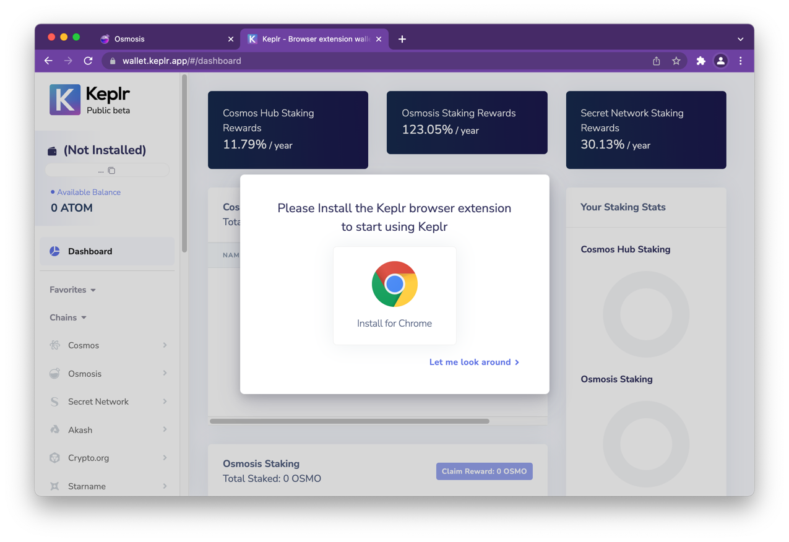
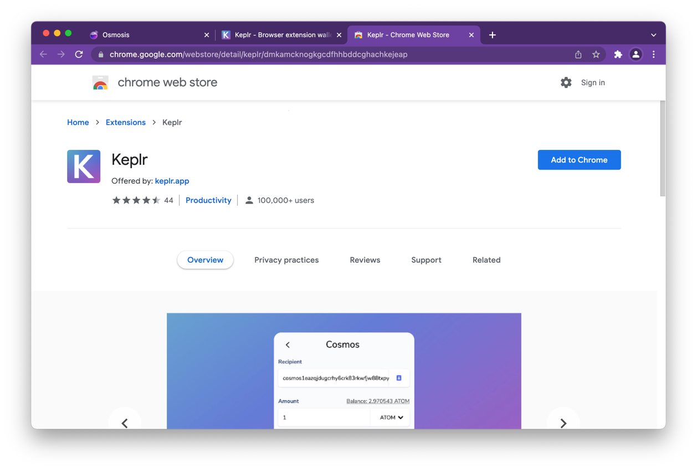
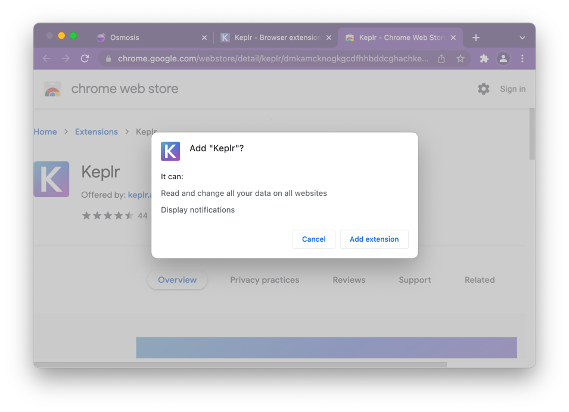
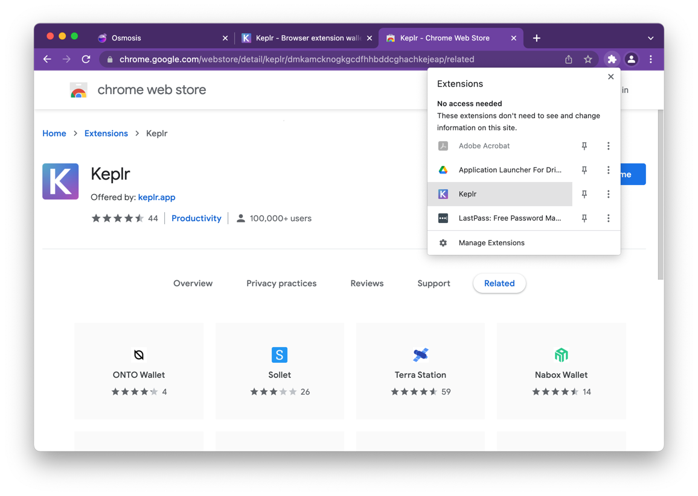

From your installed [Keplr-Wallet](https://wallet.keplr.app/)

Click the "Add to Chrome" button

Here you have to choose [Add Extension]

The Wallet is now installed on the brower's extensions

## Next steps

- [Create New Account](create-keplr-wallet)
