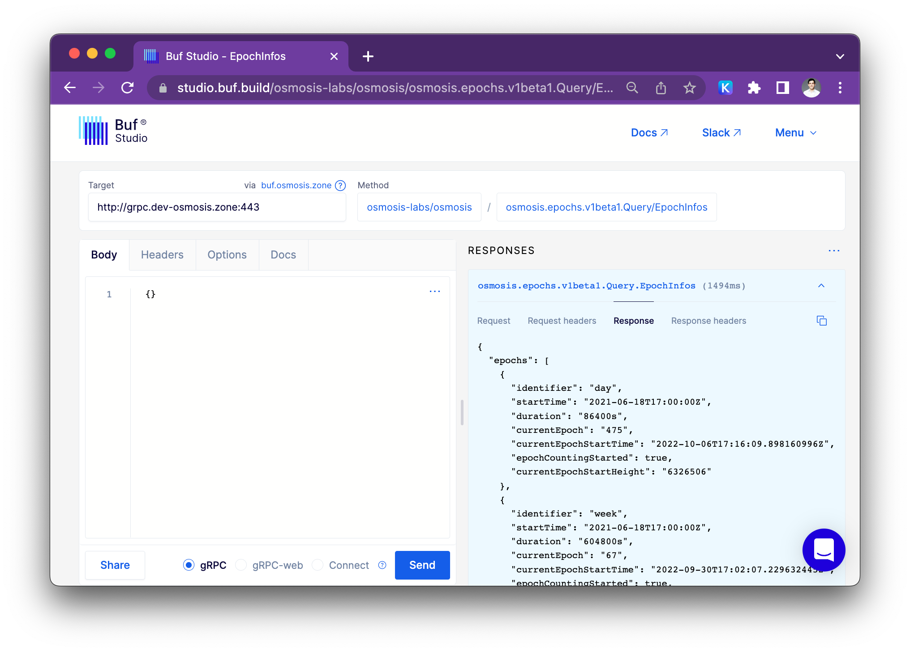

## Interacting with Buf Studio
An interactive web UI for all the gRPC and Protobuf services stored on the [Terp-Core Buf Schema Registry](https://buf.build/terpnetwork/terp-core)

Studio preconfigured with the mainnet RPC:
- [Launch Buf Studio on mainnet RPC]TBD
- [Launch Buf Studio on testnet RPC]TBD

Things you can do with buf Studio: 
- Select an endpoint from any BSR module to send requests to  gRPC
- Use the editor with schema-based autocompletion, validation and documentation to draft JSON based request messages.
- Configure headers to further customize outgoing requests.
- Optionally include cookies in outgoing request to send authenticated requests to private APIs (or Buf Studio Agent instances).
- Create shareable links for requests defined on Buf Studio to team members with access.

#### How does buf Studio work with Terp-Core 

We have a Buf agent running at https://buf.terp.network which will allow you to use the buf data studio to explore the available methods. 

#### Composing requests

