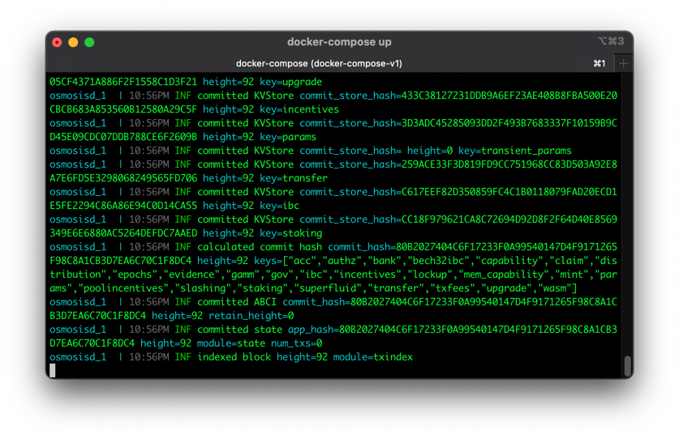

# CosmWasm & LocalTerp 

:::tip  
You can now deploy contracts to localterp with [Beaker](https://github.com/terp-core/beaker). The official tooling to deploy Terp Network Smart contracts.
:::

The following is detailed guide that shows the basics of manually deploying a contract to a Terp Network local environment. It covers: 

- **Initial Setup**
    - Rust
    - localterp via Terp-Core installer. 
        - terpd binary automatically configured to connect to your localterp
        - localterp setup in the $HOME directory (~/localterp)
- **Deploy a smart contract**
    - Clone a base template contract
    - Compile contract
    - Optimize  contract
    - Create local key
    - Store contract
    - Initialize
    - Get contract address
    - Query contract
    - Increment contract's count
    - Reset contracts count
    - Get contract's state
    - Query contract info
    - List all contracts


## Initial Setup: Rust, Contract Environment, Beaker, and Terp-Core

Before beginning, you must set up Rust, your contract environment, Beaker, and Terp-Core with one of the two following options:

### Option 1: Automatic Setup (NO)

Start the installer with the following command, choose localterp (option 3), and follow the prompts:

```bash
bash <(curl -sL https://get.terp.network/run)
```


### Option 2: Manual Setup

#### Rust

Install Rust using rustup with the following command and follow the prompts:

```bash
curl --proto '=https' --tlsv1.2 -sSf https://sh.rustup.rs | sh
```

#### Contact Environment

Set 'stable' as the default release channel:

```bash
rustup default stable
```

Add WASM as the compilation target:

```bash
rustup target add wasm32-unknown-unknown
```

Install the following packages to generate the contract:

```bash
cargo install cargo-generate --features vendored-openssl
cargo install cargo-run-scrip
```

#### Beaker

Install Beaker with the following command:

```bash
cargo install -f terp-beaker
```

#### Terp-Core

Setup v0.2.x Terp-Core

```bash
cd $HOME
git clone https://github.com/terpnetwork/terp-core.git
cd $HOME/terp-core
git checkout v0.2.x
make install
source ~/.profile
```

## Start localterp

Inside a separate bash window start localterp

```bash
cd ~/terp-core
make localnet-start
```
You will start seeing localterp block activity in your terminal. Keep localterp running while you perform the next steps in a new terminal window.



In place of doing the above commands, you can instead start localterp with pre-made pools by starting localterp with the following commands:

```bash
cd ~/terp-core
make localnet-start-with-state
```

:::tip
To view the localterp wallet information, visit the [localterp accounts page](https://github.com/terpnetwork/localterp#accounts). 
:::

## Deploy a smart contract
### Clone cw-tpl-terpnet 
For this example we will use the cw-tpl-terpnet (CosmWasm Template Terp-Core) repo that was created with the [cw-template](https://github.com/InterWasm/cw-template) repo.

```
git clone https://github.com/terpnetwork/cw-tpl-terpnet
```

### Compile the wasm contract with stable toolchain
```
rustup default stable
cargo wasm
```

After this compiles, it should produce a file in `target/wasm32-unknown-unknown/release/cw_tpl_terpnet.wasm.` A quick ls -lh should show around 1.8MB. This is a release build, but not stripped of all unneeded code. To produce a much smaller version, you can run this which tells the compiler to strip all unused code out:

```
RUSTFLAGS='-C link-arg=-s' 
cargo wasm 

```

This produces a file about 149kB. We will do further optimisation below.

### Optimized Compilation

To reduce gas costs, the binary size should be as small as possible. This will result in a less costly deployment, and lower fees on every interaction. Luckily, there is tooling to help with this. You can optimize production code using rust-optimizer. rust-optimizer produces reproducible builds of CosmWasm smart contracts. This means third parties can verify the contract is actually the claimed code.


```
sudo docker run --rm -v "$(pwd)":/code \
    --mount type=volume,source="$(basename "$(pwd)")_cache",target=/code/target \
    --mount type=volume,source=registry_cache,target=/usr/local/cargo/registry \
    cosmwasm/rust-optimizer:0.12.6
 
```

Binary will be at artifacts/terp_cw_tpl.wasm folder and its size will be 138k

### Created a local key 
Create a key using one of the seeds provided in localterp. 

```
terpd keys add <unsafe-test-key-name> --recover
```
Example test1 key from [here](https://github.com/terpnetwork/terp-core/tree/main/tests/localterp#localterp-accounts):

```
notice oak worry limit wrap speak medal online prefer cluster roof addict wrist behave treat actual wasp year salad speed social layer crew genius
```

### Store to your localterp chain

You can deploy the contract to localterp or a testnet.  In this example we will deploy to localterp.

```
cd artifacts
terpd tx wasm store cw_tpl_terpnet.wasm  --from <unsafe-test-key-name> --chain-id=<chain-id> --gas-prices 0.1upersyx --gas auto --gas-adjustment 1.3 -b block -y
```

`<unsafe-test-key-name>` = Name of your local key.
`<chain-id>` = localterp

Replace `<unsafe-test-key-name>` with the key name from your local keys. `terpd keys list`
Replace `<chain-id>` with localterp or 90u-1. 
Save the CODE_ID from the output of the command above as a local variable `CODE_ID=XX`

### Or Store CODE_ID 
Instead of looking for the code_id the command above, you can also run the following command to set the CODE_ID as a variable.
    
```
TX=$(terpd tx wasm store cw_tpl_terpnet.wasm  --from <unsafe-test-key-name> --chain-id=<chain-id> --gas-prices 0.1upersyx --gas auto --gas-adjustment 1.3 -b block --output json -y | jq -r '.txhash')
CODE_ID=$(terpd query tx $TX --output json | jq -r '.logs[0].events[-1].attributes[0].value')
echo "Your contract code_id is $CODE_ID"
```

If this is a brand new localterp instance it should be `1`
    
    
### Instantiate the contract
 
```
INITIAL_STATE='{"count":100}'
terpd tx wasm instantiate $CODE_ID $INITIAL_STATE --amount 50000upersyx  --label "Counter Contract" --from <unsafe-test-key-name> --chain-id <chain-id> --gas-prices 0.1upersyx --gas auto --gas-adjustment 1.3 -b block -y --no-admin
```

Example
```
INITIAL_STATE='{"count":100}'
terpd tx wasm instantiate $CODE_ID $INITIAL_STATE --amount 50000upersyx  --label "Counter Contract" --from c1 --chain-id localterp --gas-prices 0.1upersyx --gas auto --gas-adjustment 1.3 -b block -y --no-admin
```

### Get contract address

```
CONTRACT_ADDR=$(terpd query wasm list-contract-by-code $CODE_ID --output json | jq -r '.contracts[0]')
```

## Query Contract

### Increment contract's count

```
INCREMENT_MSG='{"increment":{}}'
terpd tx wasm execute $CONTRACT_ADDR "$INCREMENT_MSG" --from c1
```

### Reset contracts count

```
RESET_MSG='{"reset":{"count":0}}'
terpd tx wasm execute $CONTRACT_ADDR "$RESET_MSG" --from c1
```

### Get contract's state

```
GET_STATE_MSG='{"get_count":{}}'
terpd query wasm contract-state smart  $CONTRACT_ADDR "$GET_STATE_MSG"
```

### Query contract info
    
```
terpd query wasm contract $CONTRACT_ADDR
```

### List all contracts

```
terpd query wasm list-code
```

Good job! It's now time to learn how to actually develop contracts. You can now visit the [official CosmWasm contracts](https://docs.cosmwasm.com/docs/1.0/getting-started/intro) and as you explore the docs you will understand how tio actually interact with the Terp Network Blockchain.
