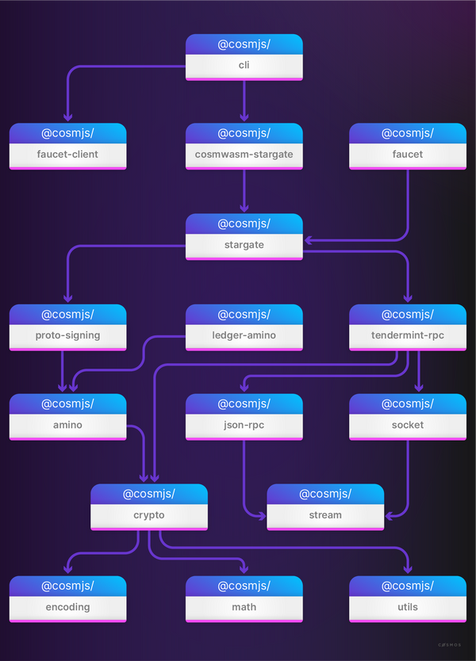

# Communicate From an App to a Cosmwasm Smart Contract

 **CosmJS is the default TypeScript/JavaScript library for interacting with smart contracts and Terp Network.**

 In general, UI's help users interpret the blockchain state, compose and sign transactions, and send them - all things that are potentially accomplished by other less convenient methods. A UI is supported by servers or micro-services that also interact with the blockchain.

### Packages
CosmJS is a library that consists of many smaller npm packages within the [@cosmjs namespace](https://www.npmjs.com/org/cosmjs), a so-called "monorepo".

Generally people only need the stargate and encoding packages as they contain the main functionality to interact with Cosmos SDK chains version 0.40 and higher.

Among many more, here are some example packages:

### Modularity
The repository is nicely modular and keeps clean dependencies. This ensures software quality and lets users pick exactly what they need and only what they need.

## [Terp-Ts](https://github.com/terpnetwork/terp-ts)

Terp-Ts is the Cosmjs library built specifically for interacting with Terp Network.  Checkout our guide on [how to use Terp-Ts](../../guides/develop/front-end/client-creation) for various functions.