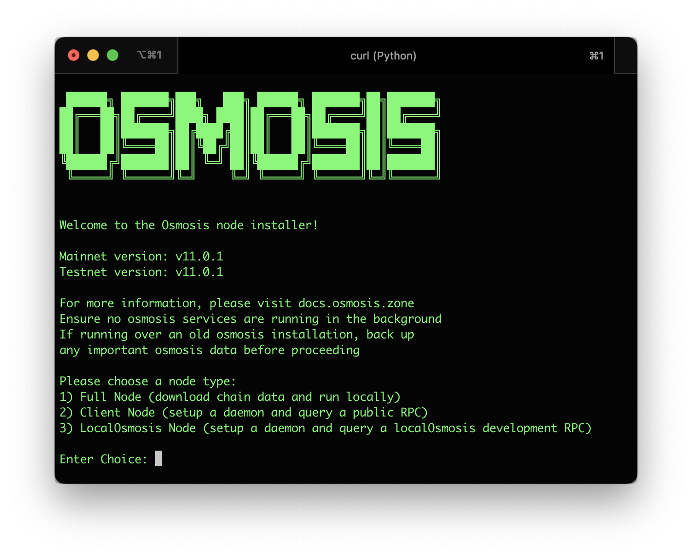

# Joining Testnet

## Terp-Core Installer

Join a network by using Terp-Core Installer from [https://get.terp.network](https://get.terp.network) 




Simply run:

```
curl -sL https://get.terp.network/install > i.py && python3 i.py
```


## Terp-Core CLI

Make sure you have [installed the Terp Core Binary (CLI)](../osmosis-core/terpd) prior to following the below instructions.

You may also [use the Terp-Core installer](../osmosis-core/terpd) if you want everything to be done automatically.

## Faucet 
In order to get testnet tokens use  [The Discord Faucet](https://discord.gg/rkwutDxvDJ)

## Initialize TerpNET Node

Use terpd to initialize your node (replace the ```NODE_NAME``` with a name of your choosing):

```bash
terpd init NODE_NAME --chain-id=athena-3
```

Open the config.toml to edit the seeds and persistent peers:

```bash
cd $HOME/.terp/config
nano config.toml
```

Use page down or arrow keys to get to the line that says seeds = "" and replace it with the following:

```bash
seeds = ""
```

Next, add persistent peers:

```bash
persistent_peers = ""
```

Then press ```Ctrl+O``` then enter to save, then ```Ctrl+X``` to exit

## Set Up Cosmovisor

Set up cosmovisor to ensure future upgrades happen flawlessly. To install Cosmovisor:

```bash
go install github.com/cosmos/cosmos-sdk/cosmovisor/cmd/cosmovisor@v1.0.0
```

Create the required directories:

```bash
mkdir -p ~/.terp/cosmovisor
mkdir -p ~/.terp/cosmovisor/genesis
mkdir -p ~/.terp/cosmovisor/genesis/bin
mkdir -p ~/.terp/cosmovisor/upgrades
```

Set the environment variables:

```bash
echo "# Setup Cosmovisor" >> ~/.profile
echo "export DAEMON_NAME=terpd" >> ~/.profile
echo "export DAEMON_HOME=$HOME/.terp" >> ~/.profile
echo "export DAEMON_ALLOW_DOWNLOAD_BINARIES=false" >> ~/.profile
echo "export DAEMON_LOG_BUFFER_SIZE=512" >> ~/.profile
echo "export DAEMON_RESTART_AFTER_UPGRADE=true" >> ~/.profile
echo "export UNSAFE_SKIP_BACKUP=true" >> ~/.profile
source ~/.profile
```

You may leave out `UNSAFE_SKIP_BACKUP=true`, however the backup takes a decent amount of time and public snapshots of old states are available.

Download and replace the genesis file:

```bash
cd $HOME/.terp/config
curl https://raw.githubusercontent.com/terpnetwork/test-net/master/athena-3/genesis.json
```

Copy the current terpd binary into the cosmovisor/genesis folder:

```bash
cp $GOPATH/bin/terpd ~/.terp/cosmovisor/genesis/bin
```

To check your work, ensure the version of cosmovisor and terpd are the same:

```bash
cosmovisor version
terpd version
```

These two command should both output 7.0.3

Reset private validator file to genesis state:

```bash
terpd unsafe-reset-all
```

## Download Chain Data

Download the latest chain data from a snapshot provider. In the following commands, I will use <a href="" target="_blank">https://tools.highstakes.ch/snapshots/terp</a> to download the chain data. You may choose the pruned or archive based on your needs.

Download liblz4-tool to handle the compressed file:

```bash
sudo apt-get install wget liblz4-tool aria2 -y
```

Download the chain data:

- Select the tab to the desired node type (Pruned or Archive)

```bash
wget https://tools.highstakes.ch/files/terp.tar.gz
```

extract to ~/.terp 
```
tar -xvf terp.tar.gz -C ~/.terp/
```

## Set Up Terp-Core Service

Set up a service to allow cosmovisor to run in the background as well as restart automatically if it runs into any problems:

```bash
echo "[Unit]
Description=Cosmovisor daemon
After=network-online.target
[Service]
Environment="DAEMON_NAME=terpd"
Environment="DAEMON_HOME=${HOME}/.terp"
Environment="DAEMON_RESTART_AFTER_UPGRADE=true"
Environment="DAEMON_ALLOW_DOWNLOAD_BINARIES=false"
Environment="DAEMON_LOG_BUFFER_SIZE=512"
Environment="UNSAFE_SKIP_BACKUP=true"
User=$USER
ExecStart=${HOME}/go/bin/cosmovisor start
Restart=always
RestartSec=3
LimitNOFILE=infinity
LimitNPROC=infinity
[Install]
WantedBy=multi-user.target
" >cosmovisor.service
```

Move this new file to the systemd directory:

```bash
sudo mv cosmovisor.service /lib/systemd/system/cosmovisor.service
```

## Start Terp-Core Service

Reload and start the service:

```bash
sudo systemctl daemon-reload
systemctl restart systemd-journald
sudo systemctl start cosmovisor
```

Check the status of the service:

```bash
sudo systemctl status cosmovisor
```

To see live logs of the service:

```bash
journalctl -u cosmovisor -f
```

