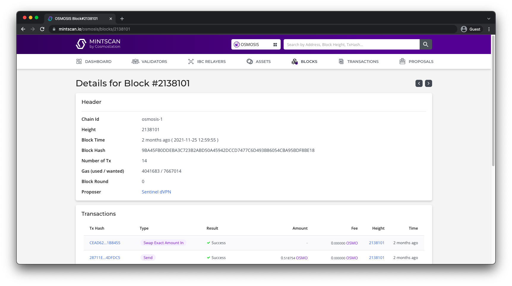

# Airdrop Guide

## Overview

As more chains enter the cosmos ecosystem, more projects may desire to airdrop their tokens to terp network accounts.

This document lays out the process of creating a state export to derive all terp network account addresses that exists at a specified height. We will then show how to further filter this list to also airdrop to accounts providing liquidity to specific terp network pools.

### Prerequisites
1. Know what height you want to take the snapshot at
2. Know the pool IDs if looking to airdrop to accounts LPing to specific pools
3. Run an terp-core node with enough state history to state export at the desired height


### Choosing a block height
The current Terp Network block height can be found on the [ZenChain blocks page.](https://terp.zenscan.io/)To find the date/time of a specific block height in the past, type the desired block height in the Zenscan search bar and press enter. Here is the Zenscan block height page for block [586664](https://terp.zenscan.io/block.php?height=586664)



In this example, block height 586664 happened on 6 February 2023 at 16:03:5PM local time.


### Determine terp-core node type requirement
First, determine how far in the past the desired block height is from the current time. If the desired block height is within the last seven days, you can make the state export with a default snapshot node. Anything further in the past more than likely needs to be done by setting up a node with an archive snapshot.

In our example, block height 586664 is in the past, so we must use an archive snapshot.


### Run an terp-core node
To set up either a default or archive node, either use the terp network bash installer [located here](https://get.terp.network/) OR follow the instructions step by step [starting here.](../../terp-core/terpd) Ensure you follow the instructions for mainnet and set up using either the archive or default snapshot as determined above. Do not use state sync for this situation.


### Install the daemon version corresponding to snapshot height
If you are looking to take a snapshot for a block height that occurred during a previously breaking major release (i.e v0.1x, v0.2x etc.), you must ensure your daemon is running that version before taking the state export. To see the block height for all major releases, go to [Terp-Core Releases](https://github.com/terpnetwork/terp-core/releases) sand check the titles of all major releases. You will see the block height the upgrade took place in the title. In our example, we are taking a state export at block height 586664. We must ensure the daemon is now running v0.2x before we take the state export:

```sh
cd $HOME/terp-core
git checkout v0.2.0
make install
```

Then check the version

```sh
terpd version
```

Which in this example should output 0.2.0

To reiterate, if your snapshot is being taken on a more recent height where the daemon version is still current, this step will not be required and you can continue with the current daemon version.


### Take the state export (snapshot)
Ensure the daemon is not running in the background. Then, to take a state export at a specified height (in this example 2138101):

```sh
terpd export 586664 > state_export.json
```

This process may take 30 minutes or more.


### Export accounts in JSON format
TBD
